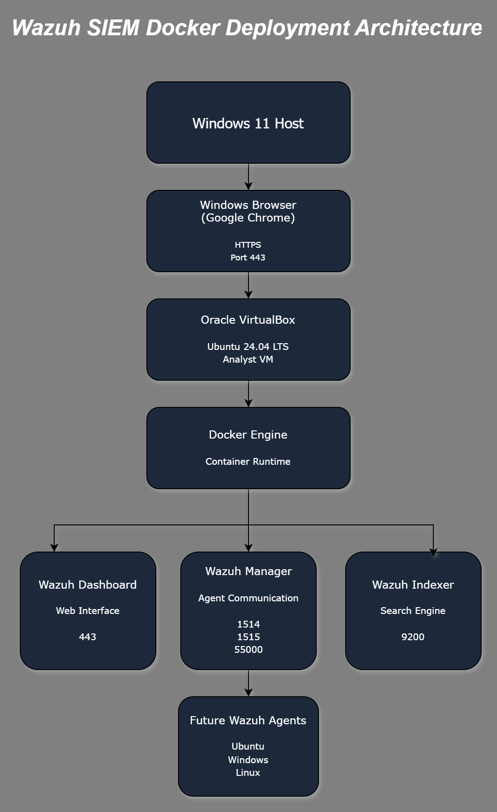
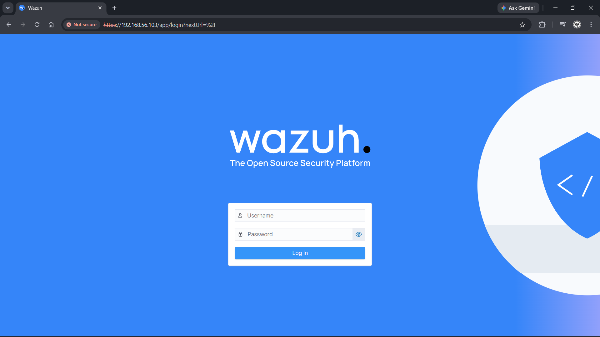
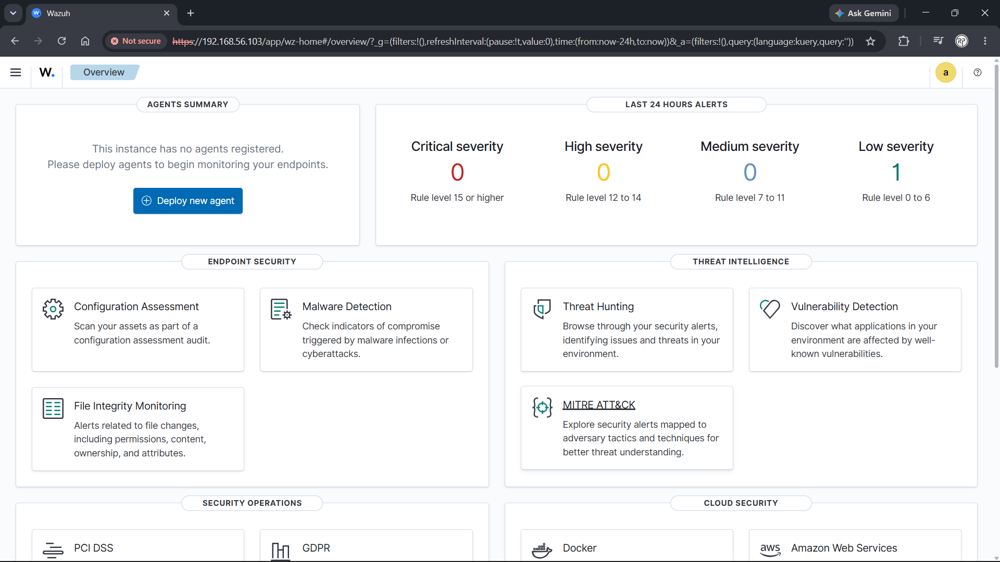
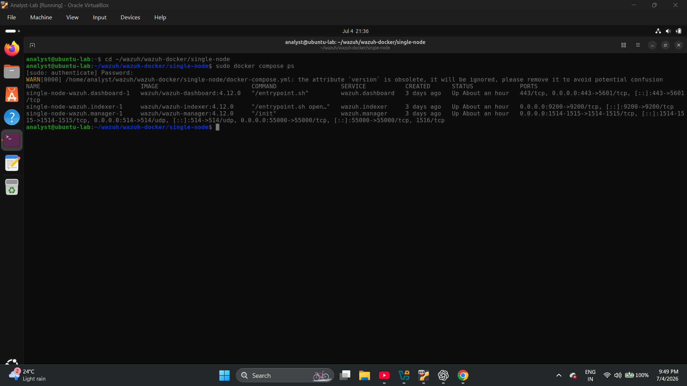
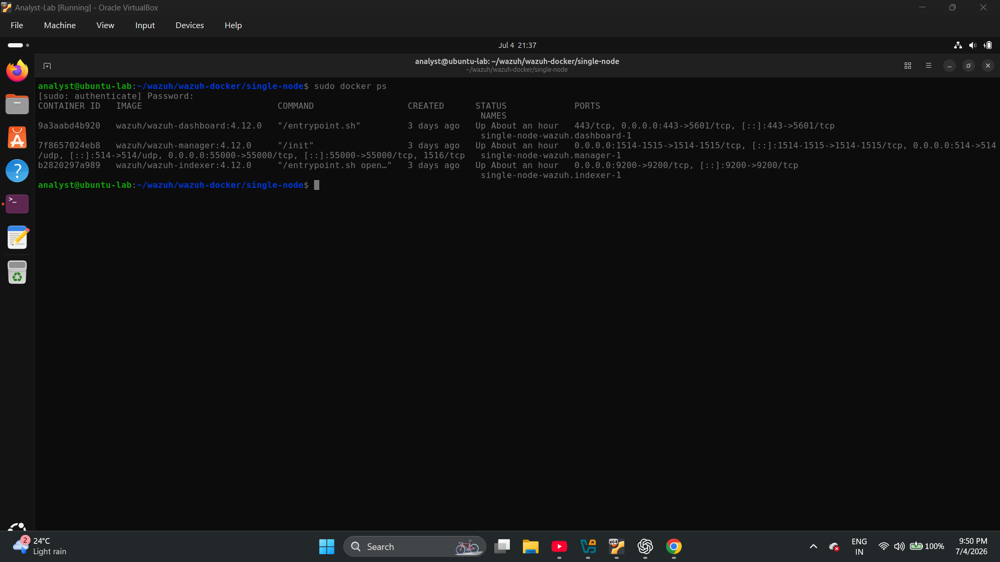
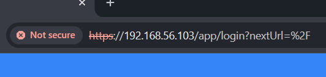
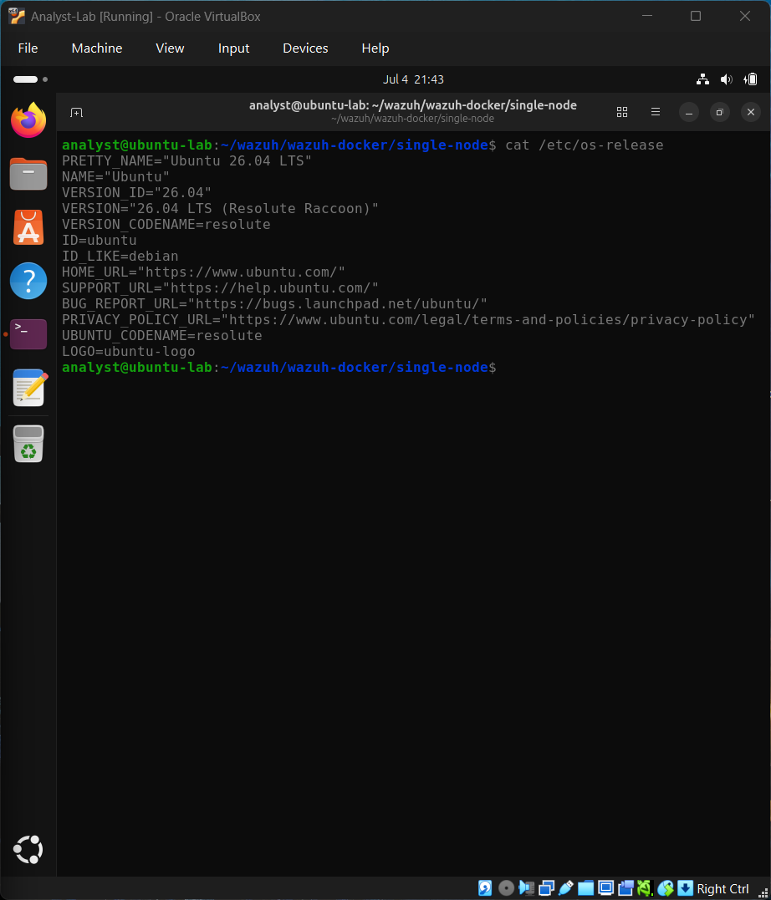
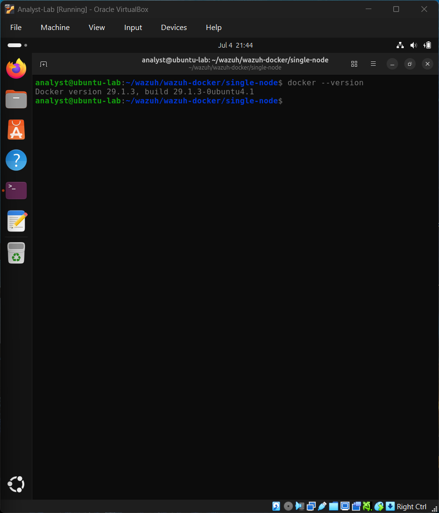
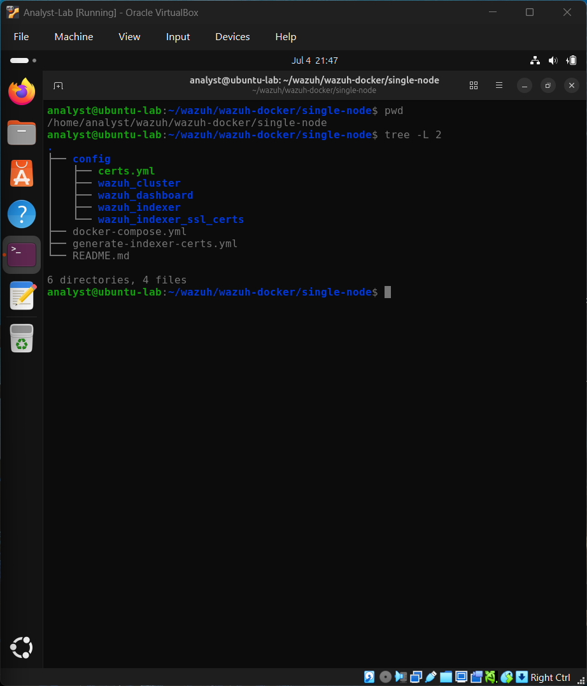

# Wazuh SIEM Deployment using Docker

> Enterprise-style deployment of the Wazuh Security Information and Event Management (SIEM) platform using Docker in an Ubuntu virtual machine. This project documents the complete deployment process, architecture, verification, troubleshooting, and lessons learned while building a practical Security Operations Center (SOC) home lab.

---

## Project Overview

Security Information and Event Management (SIEM) platforms are an essential part of modern Security Operations Centers (SOCs). They collect, process, correlate, and visualize security events from multiple systems, enabling analysts to detect suspicious activity and investigate incidents efficiently.

This project demonstrates the deployment of a complete Wazuh SIEM environment using Docker Compose inside an Ubuntu virtual machine. The objective was not simply to install Wazuh, but to understand its architecture, verify that every component functioned correctly, troubleshoot deployment issues, and create professional documentation for future reference.

The deployment includes the following core services:

- Wazuh Dashboard
- Wazuh Manager
- Wazuh Indexer
- Docker Engine
- Ubuntu 24.04 LTS

This repository serves as the foundation for future cybersecurity projects involving endpoint monitoring, attack simulation, log analysis, detection engineering, and incident response.

---

## Project Objectives

- Deploy Wazuh using Docker Compose.
- Understand the architecture of a Docker-based SIEM platform.
- Verify successful communication between all Wazuh services.
- Document deployment, verification, and troubleshooting.
- Build a professional cybersecurity portfolio project.

---

## Lab Architecture

The Wazuh environment is hosted inside an Ubuntu virtual machine running on Oracle VirtualBox. Docker Compose orchestrates the deployment of the Wazuh containers, while the dashboard is accessed securely through HTTPS from the Windows host machine.



### Components

| Component | Purpose |
|-----------|---------|
| Windows 11 Host | Used to access the Wazuh Dashboard through a web browser. |
| Oracle VirtualBox | Provides the virtualization environment. |
| Ubuntu 24.04 LTS | Hosts the Docker Engine and Wazuh services. |
| Docker Engine | Runs and manages all Wazuh containers. |
| Wazuh Dashboard | Web interface for monitoring and investigation. |
| Wazuh Manager | Collects and analyzes security events. |
| Wazuh Indexer | Stores and indexes security data for fast searching and visualization. |

---

## Lab Environment

| Component | Specification |
|-----------|---------------|
| Host Operating System | Windows 11 |
| Virtualization Platform | Oracle VirtualBox |
| Guest Operating System | Ubuntu 24.04 LTS |
| Container Platform | Docker Engine |
| Container Orchestration | Docker Compose |
| SIEM Platform | Wazuh 4.12.0 |
| Access Method | HTTPS via Ubuntu VM IP Address |

---

## Deployment Procedure

The deployment was performed using the official Wazuh Docker single-node environment. Docker Compose was used to orchestrate all required containers while Ubuntu served as the host operating system inside Oracle VirtualBox.

### 1. Clone the Official Repository

```bash
git clone https://github.com/wazuh/wazuh-docker.git
```

This downloads the official Wazuh Docker deployment files.

---

### 2. Navigate to the Single-Node Deployment

```bash
cd wazuh-docker/single-node
```

The single-node deployment is suitable for home labs, learning environments, and proof-of-concept deployments.

---

### 3. Generate SSL Certificates

Before starting the containers, SSL certificates were generated for secure communication between Wazuh components.

```bash
docker compose -f generate-indexer-certs.yml run --rm generator
```

---

### 4. Deploy the Containers

```bash
docker compose up -d
```

Docker Compose creates and starts:

- Wazuh Dashboard
- Wazuh Manager
- Wazuh Indexer

---

### 5. Verify the Deployment

The following commands were used to verify that all services were running correctly.

```bash
docker compose ps
```

```bash
docker ps
```

---

### 6. Access the Dashboard

Once all services were operational, the Wazuh Dashboard was accessed through the Ubuntu virtual machine using HTTPS.

```
https://<Ubuntu_VM_IP>
```

The default credentials for the deployment were:

```
Username : admin
Password : SecretPassword
```

> **Note:** The browser displays a security warning because Wazuh uses a self-signed SSL certificate in the lab environment.

---

## Deployment Verification

After deployment, multiple verification steps were performed to confirm that the environment was functioning correctly.

### Verification Checklist

- Docker containers started successfully.
- Wazuh Dashboard was accessible through HTTPS.
- All Wazuh services were operational.
- Docker Compose reported healthy containers.
- Remote access from the Windows host was successful.

### Deployment Evidence

### Login Page



---

### Dashboard



---

### Docker Compose Status



---

### Running Containers



---

### Remote Dashboard Access



---

### Ubuntu Version



---

### Docker Version



---

### System Information


---

### Project Structure


